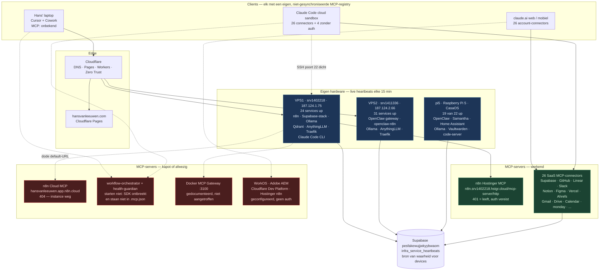

# MCP-server netwerkvalidatie

> Uitgevoerd: 2026-08-19 · Vanaf: Claude Code remote sandbox (cloud), repo `hans-crafted-stories`
> Vraag: welke MCP-servers draaien er in het netwerk, en kent ieder device ze?
> **Kort antwoord: nee.** Er is geen enkel device dat dezelfde MCP-set kent als een ander, en er bestaat
> geen mechanisme in de stack dat dat zou kunnen afdwingen.
>
> Visuele versie (netwerktekening + validatiematrix): https://claude.ai/code/artifact/bcc15b53-3fe6-47d0-9f0c-b4782fa78b76

> **Update 2026-08-19, na reparatie:** F2, F3 en F4 zijn opgelost en geverifieerd — zie
> [`docs/mcp-registry.md`](./mcp-registry.md) en sectie 7 onderaan. F1 is opgelost binnen de
> MCP-laag; buiten de MCP-laag staat de dode URL nog in de frontend en twee edge functions.

---

## 0. Methode en grenzen

Wat wél gemeten is:

| Bron | Hoe |
|---|---|
| MCP-servers van het claude.ai-account | Live tool-inventaris van deze sessie + `~/.claude/mcp-needs-auth-cache.json` |
| Self-hosted MCP-endpoints | HTTP-probes (`initialize` JSON-RPC POST + GET) vanaf deze sandbox |
| Repo-lokale MCP-servers | Broncode gelezen én daadwerkelijk gestart (`node .claude/mcp/*/index.js`) |
| Devices in het netwerk | Live heartbeats uit Supabase `pesfakewujjwkyybwaom.public.infra_service_heartbeats` |
| Service-registry | Supabase `public.infrastructure_services` |

Wat **niet** gemeten kon worden (en dus niet als "ok" is gerapporteerd):

- SSH naar VPS1/VPS2 — poort 22 is dicht vanaf deze sandbox (`srv1402218:22`, `srv1411336:22`, `187.124.1.75:22` alle geblokkeerd). De MCP-config op die machines (`/root/.claude.json`) is dus niet direct gelezen.
- De MCP-config van Hans' laptop (Cursor / Cowork desktop) en van de pi5.
- Alles achter een SSH-tunnel (Ollama 11434, Qdrant 6333, AnythingLLM 3001) — die zijn per definitie niet extern bereikbaar.

---

## 1. Inventaris: alle MCP-servers in het netwerk

### 1A. Verbonden op het claude.ai-account (26 servers)

Deze zijn in deze sessie daadwerkelijk verbonden en callable:

`Ahrefs` · `Anthropic_Economic_Index` · `Booking_com` · `Canva` · `Claude_Code_Remote` · `Expedia` ·
`Figma` · `Gmail` · `Google_Calendar` · `Google_Drive` · `Hugging_Face` · `Kernel` · `Legal_Data_Hunter` ·
`Linear` · `Lucid` · `Malwarebytes` · `Notion` · `Ramp_Data` · `Slack` · `Spotify` · `Supabase` ·
`Tripadvisor` · `Vercel` · `Webflow` · `github` · `monday_com`

### 1B. Geconfigureerd maar niet geauthenticeerd (4 servers)

Uit `~/.claude/mcp-needs-auth-cache.json` — bekend bij het account, maar zonder geldige auth in deze sessie:

| Server | Betekenis |
|---|---|
| `Hostinger_n8n` | De self-hosted n8n MCP op VPS1 — auth ontbreekt in deze sessie |
| `Cloudflare_Developer_Platform` | `https://bindings.mcp.cloudflare.com/mcp` — probe geeft 401 |
| `WorkOS` | Niet in de architectuurdocumentatie terug te vinden |
| `Adobe_Experience_Manager` | Niet in de architectuurdocumentatie terug te vinden |

### 1C. Self-hosted MCP-endpoints (probe-resultaten)

| Endpoint | GET | MCP `initialize` POST | Oordeel |
|---|---|---|---|
| `https://n8n.srv1402218.hstgr.cloud/mcp-server/http` | 401 | 401 | **Leeft.** Endpoint bestaat, vraagt bearer-token |
| `https://hansvanleeuwen.app.n8n.cloud/mcp-server/http` | 404 | 404 | **Bestaat niet** |
| `https://mcp.supabase.com/mcp` | — | 401 | Leeft (in deze sessie via OAuth verbonden) |
| `https://bindings.mcp.cloudflare.com/mcp` | — | 401 | Leeft, auth ontbreekt |
| `https://huggingface.co/mcp` | — | 200 | Leeft |
| `https://mcp.figma.com/mcp` | — | 401 | Leeft |
| `https://mcp.monday.com/mcp` | — | 401 | Leeft |

Ter controle van de n8n Cloud-uitkomst: ook `https://hansvanleeuwen.app.n8n.cloud/` en `/healthz` geven 404,
terwijl `https://n8n.srv1402218.hstgr.cloud/` en `/healthz` beide 200 geven. De n8n Cloud-instance
reageert dus als geheel niet meer — het is niet alleen het MCP-pad.

### 1D. Repo-lokale stdio MCP-servers (2 servers, beide stuk)

| Server | Pad | Tools | Status |
|---|---|---|---|
| `workflow-orchestrator` | `.claude/mcp/workflow-orchestrator/index.js` | `list_webhooks`, `trigger_webhook`, `n8n_health`, `git_status`, `git_changed_files`, `deployment_map`, `trigger_deploy` | **Start niet** |
| `health-guardian` | `.claude/mcp/health-guardian/index.js` | `health_check_all`, `health_check_layer`, `health_report`, `log_event`, `trigger_alert`, `list_endpoints`, `health_run_and_log` | **Start niet** |

Bewijs (letterlijk uitgevoerd):

```
$ node .claude/mcp/workflow-orchestrator/index.js
Error [ERR_MODULE_NOT_FOUND]: Cannot find package '@modelcontextprotocol/sdk'
    imported from .../.claude/mcp/workflow-orchestrator/index.js
```

Beide mappen bevatten wel `package.json` + `package-lock.json`, maar geen `node_modules`, en er is nergens
een install-stap die dat op een vers device regelt. `node_modules` staat in `.gitignore`, dus dit is op
**elk** device zo dat de repo vers gekloond wordt.

### 1E. Gedocumenteerd, maar niet aangetroffen

- **Docker MCP Gateway (poort 3100)** — genoemd in `docs/empire-n8n-flow.md`, `docs/inventory-secrets-and-workflows.md`,
  `docs/secrets-inventory.md`, de `hansai-chat` systeemprompt en de Command Center UI (`mcp-gateway` context-categorie).
  In de live heartbeats van vps1, vps2 en pi5 komt geen enkele container voor die hierop lijkt.
  Ook `infrastructure_services` bevat geen MCP-gateway-entry. Behandel dit voorlopig als **niet draaiend**.
- **`Claude_Preview`** — staat in `.claude/settings.local.json` als toegestane permissie (`mcp__Claude_Preview__preview_start`),
  maar bestaat nergens als geconfigureerde server.

---

## 2. Devices in het netwerk

Uit live heartbeats (`infra_service_heartbeats`, laatste ronde 2026-08-19 04:30 UTC):

| Host | Services | Up | Laatste heartbeat |
|---|---|---|---|
| `pi5` | 22 | 19 | 2026-08-19 04:30 |
| `vps1` (srv1402218 / 187.124.1.75) | 24 | 24 | 2026-08-19 04:30 |
| `vps2` (srv1411336 / 187.124.2.66) | 31 | 31 | 2026-08-19 04:30 |

**pi5** (Raspberry Pi 5, CasaOS) draait: `2fauth`, `actualbudget`, `big-bear-openclaw`, `chromium`,
`code-server`, `hermes`, `homeassistant`, `homebridge`, `music-files`, `ollama` (2 modellen), `openlist`,
`plex`, `samantha-brain`, `samantha-gateway`, `syncthing`, `vaultwarden`, `waha`.
Down: `big-bear-chrome`, `big-bear-tailscale`, `whisper-batch`.

**vps1** draait een volledige self-hosted Supabase-stack (`supabase-db/auth/rest/kong/storage/studio/...`),
`n8n-n8n-1`, `hansai-n8n-1`, `hansai-ollama-1`, `hansai-qdrant-1`, `hansai-anythingllm-1`, `evolution-api`,
`n8n-terminal-1`, `traefik`.

**vps2** draait `openclaw-cvpd-openclaw-1`, `openclaw-n8n`, `ollama-hu0h-ollama-1`,
`anythingllm-67xv-anythingllm-1`, `metube`, `ha-proxy`, `traefik` + een tweede Supabase-stack.

Daarnaast, niet-heartbeatend maar wel deel van het netwerk:

- **Hans' laptop** — Cursor + Cowork desktop; `docs/monday-mcp-setup.md` beschrijft MCP-configuratie specifiek voor Cursor.
- **Claude Code CLI op VPS1** — volgens `docs/god-structure-architecture-v2.md` §2.5 met `/root/.claude.json` → `n8n-hostinger` + `n8n-cloud`.
- **Deze cloud sandbox** — ephemeral, kent de 26 account-connectors.
- **claude.ai web/mobiel** — zelfde account-connectors.

---

## 3. Validatie: kent ieder device dezelfde MCP-servers?

**Nee.** Per device:

| Device | Kent MCP-servers | Geverifieerd? |
|---|---|---|
| Claude Code cloud sandbox (deze sessie) | 26 verbonden + 4 zonder auth | ✅ direct gemeten |
| claude.ai web / mobiel | zelfde account-connectors | ⚠️ afgeleid (zelfde account, niet apart gemeten) |
| Claude Code CLI op VPS1 | `n8n-hostinger`, `n8n-cloud` (2) | ❌ niet te verifiëren — SSH dicht vanaf hier; bron is documentatie van 2026-03-08 |
| Hans' laptop (Cursor / Cowork) | onbekend, minimaal `monday` | ❌ niet te verifiëren |
| OpenClaw op VPS2 | onbekend | ❌ niet te verifiëren; `/mcp` op de gateway geeft weliswaar 200, maar de SPA geeft **elke** URL 200 (ook `/definitely-not-a-real-path-xyz`) — dat is dus geen bewijs van een MCP-endpoint |
| pi5 | onbekend | ❌ niet te verifiëren |
| Repo-lokale servers, op elk device | 0 van 2 werkend | ✅ direct gemeten (start-fout) |

De sets overlappen nauwelijks: VPS1 kent volgens documentatie 2 servers waarvan er 1 dood is; het
claude.ai-account kent er 26 waarvan geen enkele de self-hosted n8n MCP is (die staat op "needs auth").
Het snijvlak van "wat elk device kent" is in de praktijk **leeg**.

---

## 4. Bevindingen

**F1 — n8n Cloud is dood, maar zit overal hardcoded.**
`https://hansvanleeuwen.app.n8n.cloud` geeft 404 op `/`, `/healthz` en `/mcp-server/http`. Toch is het de
default in `.env.production` (`VITE_N8N_URL`, `VITE_N8N_WEBHOOK_URL`, `VITE_N8N_API_URL`), in `.env.example`
(`VITE_N8N_PROD_URL`), in `health-guardian/index.js` (`N8N_URL`), in `workflow-orchestrator/index.js`
(alle 6 webhooks + `n8n_health`), in `supabase/functions/empire-health` en in `docs/system-map.md`.
Alles wat op die default terugvalt, faalt stil. `CLAUDE.md` gebruikt wél de juiste host
(`n8n.srv1402218.hstgr.cloud`) — de repo spreekt zichzelf dus tegen.

**F2 — De twee repo-eigen MCP-servers starten op geen enkel device.**
Zie 1D. Er is geen `npm install`-stap, geen postinstall-hook en geen bootstrap-script dat de SDK installeert.

**F3 — De MCP-registratie in `.claude/settings.local.json` wordt niet geladen.**
Het `mcpServers`-blok staat in `.claude/settings.local.json`. Claude Code laadt project-MCP-servers uit
`.mcp.json` in de repo-root; er is geen `.mcp.json` in deze repo (`git ls-files` bevestigt dat).
Waarneming die dat ondersteunt: deze sessie draait mét de repo als working directory, en het projectrecord
in `~/.claude.json` staat op `mcpServers: {}` en `enabledMcpjsonServers: []`; geen van beide servers
verschijnt als tool. Ook los van F2 zouden ze dus niet geladen worden.

**F4 — Er is geen gedeelde bron van waarheid voor MCP.**
Elk device houdt zijn eigen registry: `~/.claude.json` per machine, Cursor-settings op de laptop,
account-connectors op claude.ai, OpenClaw-config op VPS2. Niets synchroniseert die, niets vergelijkt ze,
en niets alarmeert bij drift. "Bekend bij ieder device" is met de huidige opzet niet afdwingbaar —
dat is de kern van het antwoord op de vraag.

**F5 — `infrastructure_services` is 5 maanden oud en klopt niet meer.**
9 rijen, `last_health_check` = 2026-03-12, terwijl de heartbeat-tabel elke 15 minuten schrijft.
Alle 9 rijen hebben `vps_node = "srv1402218"`, ook `n8n-cloud`, `cloudflare-workers` en
`vercel-hansvanleeuwen` — dat is feitelijk onjuist. `pi5` en `vps2` komen er niet in voor.
Er staat **geen enkele MCP-server** in de registry.

**F6 — De Docker MCP Gateway (:3100) is nergens aantoonbaar.** Zie 1E.

**F7 — Heartbeat-status is niet vers-gecontroleerd.**
Op vps2 staan 17 services op `status = up` met `reported_at = 2026-08-16`, naast 14 services van vandaag.
Die oude rijen zijn waarschijnlijk verplaatste/gestopte containers die nooit op `down` gezet zijn.
Een dashboard dat op `status` filtert zonder `reported_at` te wegen, telt ze mee als draaiend.

**F8 — Supabase-projectmismatch.**
`health-guardian` en `.env.production` wijzen naar `https://oejeojzaakfhculcoqdh.supabase.co`.
Dat project is niet zichtbaar via de Supabase MCP van dit account; zichtbaar zijn o.a.
`pesfakewujjwkyybwaom` ("Claude n8n", waar de heartbeats in staan) en `kskumhtisifsdjjbzvbo` ("ccp-marketplace").
Of `oejeojzaakfhculcoqdh` in een andere organisatie zit of niet meer bestaat, is vanaf hier niet vast te stellen.

---

## 5. Aanbevelingen, in volgorde

1. **`.mcp.json` in de repo-root** met `workflow-orchestrator` en `health-guardian`. Dat is de enige
   MCP-configuratie die met een `git clone` meereist — daarmee kent elk device dat de repo checkt
   automatisch dezelfde twee servers. Verplaats het blok uit `.claude/settings.local.json`.
2. **Installatiestap toevoegen** (`npm install --prefix .claude/mcp/<server>` in een bootstrap- of
   postinstall-script), anders blijft F2 staan ook ná stap 1.
3. **Eén n8n-URL-variabele**, met de VPS1-host als default en de dode cloud-URL eruit. Los daarvan:
   besluit of n8n Cloud terugkomt of definitief uit de docs en `.env` verdwijnt.
4. **MCP opnemen in de heartbeat.** Het bestaande heartbeat-script schrijft al per host naar
   `infra_service_heartbeats`; laat het ook de MCP-registry van dat device meesturen. Dan is
   "kent ieder device dezelfde servers?" een query in plaats van een handmatig onderzoek.
5. **`infrastructure_services` opruimen of afvoeren** — nu geeft de tabel een verkeerd beeld (F5),
   en de heartbeat-tabel is aantoonbaar beter.

---

## 6. Netwerktekening



Gestippelde lijnen zijn verbindingen die stuk of onbevestigd zijn. Wat opvalt aan de tekening:
de drie hosts praten alleen via Supabase met elkaar, en geen enkele client heeft een werkende
MCP-verbinding naar de eigen infrastructuur — de enige werkende self-hosted MCP (n8n op VPS1) staat
op het account als "needs auth".

---

## 7. Wat er is gerepareerd (2026-08-19)

De diagnose hierboven bleef staan; dit is wat er daarna is gebouwd en aangetoond.

### Het mechanisme

| Nieuw | Rol |
|---|---|
| `ops/mcp/registry.json` | Canonieke lijst: welke MCP-servers bestaan, en welk device hoort ze te kennen. Inclusief `retired` en `unverified`. |
| `.mcp.json` (repo-root) | De registratie die Claude Code daadwerkelijk laadt en die met `git clone` meereist. |
| `scripts/mcp-setup.mjs` — `npm run mcp:setup` | Installeert de dependencies van de repo-servers. |
| `scripts/mcp-audit.mjs` — `npm run mcp:audit` | Bewijst per device dat het klopt. Exitcode 1 bij drift. |
| `docs/mcp-registry.md` | Runbook: device aansluiten, server toevoegen, server afvoeren. |

De audit doet geen bestandscontrole maar een echte MCP-handshake: hij start elke stdio-server
en draait `initialize` → `notifications/initialized` → `tools/list`, en vergelijkt de
tool-namen met `expectedTools`. HTTP-endpoints krijgen een echte JSON-RPC `initialize`-POST.

### Bewijs uit deze sessie

```
$ npm run mcp:setup
→ workflow-orchestrator: npm install in .claude/mcp/workflow-orchestrator
✓ workflow-orchestrator: klaar
→ health-guardian: npm install in .claude/mcp/health-guardian
✓ health-guardian: klaar

$ npm run mcp:audit
SERVER                  HIER NODIG  STATUS              DETAIL
workflow-orchestrator   ja          ✓ ok                7 tools
health-guardian         ja          ✓ ok                7 tools
n8n-hostinger           nee         ✓ ok                HTTP 401 (auth vereist, endpoint leeft)
supabase                nee         ✓ ok                HTTP 401 (auth vereist, endpoint leeft)
cloudflare-bindings     nee         ✓ ok                HTTP 401 (auth vereist, endpoint leeft)
monday                  nee         ✓ ok                HTTP 401 (auth vereist, endpoint leeft)

Geen drift op dit device.
```

Diezelfde twee servers gaven vóór deze wijziging `ERR_MODULE_NOT_FOUND`.

### Devices elkaar laten zien

`npm run mcp:audit -- --report` schrijft per server een rij naar `infra_service_heartbeats`
met `host = <device>` en `service = mcp:<id>` — dezelfde tabel waar pi5, vps1 en vps2 al elk
kwartier in melden. Daarmee wordt "kent ieder device dezelfde servers?" een query in plaats
van een onderzoek. Zonder `SUPABASE_URL` + `SUPABASE_SERVICE_KEY` doet de vlag niets.
**Nog niet uitgevoerd tegen productie** — dat is een schrijfactie op de live tabel en wacht
op Hans' akkoord.

### Status per bevinding

| | Status |
|---|---|
| **F1** n8n Cloud hardcoded | **Deels opgelost.** Beide MCP-servers wijzen nu naar `n8n.srv1402218.hstgr.cloud` (200 op `/healthz`). De audit waarschuwt als de dode host terugkeert als default. Nog open in `apps/personal/src/lib/config/infrastructure.ts`, `WorkflowViewerModal.tsx`, `supabase/functions/_shared/workflows.ts`, `empire-health` en `.env.production` — dat raakt productie-edge-functions en de site-UI en hoort in een eigen change. Bijgehouden in `retired[].stillReferencedIn`. |
| **F2** servers starten niet | **Opgelost en aangetoond.** `npm run mcp:setup` + handshake met 7 tools per server. |
| **F3** registratie werd niet gelezen | **Opgelost.** Verhuisd van `.claude/settings.local.json` naar `.mcp.json`. |
| **F4** geen gedeelde bron van waarheid | **Opgelost.** `ops/mcp/registry.json` + audit + optionele heartbeat-publicatie. |
| **F5** `infrastructure_services` stil | **Open.** Databewerking, aparte beslissing (opruimen of afvoeren). |
| **F6** Docker MCP Gateway afwezig | **Vastgelegd.** Staat als `retired` in de registry zodat hij niet opnieuw als bestaand wordt aangenomen. |
| **F7** heartbeat-versheid | **Open.** Zit in de dashboardlogica, niet in de MCP-laag. |
| **F8** Supabase-projectmismatch | **Open.** Niet vanaf deze sessie te beslissen; ongewijzigd gelaten in plaats van gegokt. |
